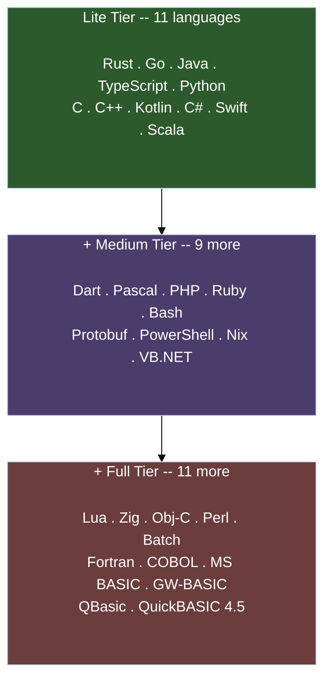
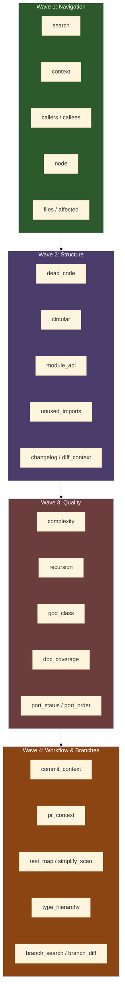
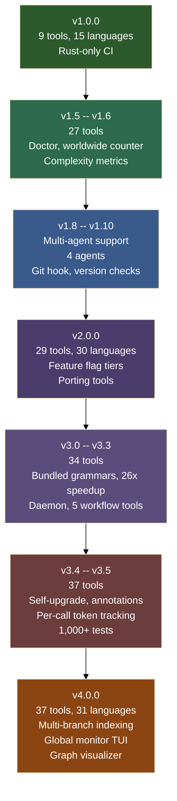

# TokenSave: From 1.0 to 6.0, the Story So Far

[Illustration: generate a landscape oriented image of a glowing semantic knowledge graph floating above a laptop screen, with nodes and edges made of light connecting code symbols, a small orange crab perched on the laptop corner observing the graph, dark workspace background with subtle warm lighting, photographic style with shallow depth of field]

TokenSave reached 1.0.0 on March 24, 2026. It could index Rust projects, serve a handful of MCP tools over stdio, and save Claude Code from burning tokens on redundant file scans. Useful, but narrow. Three weeks and forty-plus releases later, it speaks 31 programming languages, runs as an upgrade-aware background daemon, installs itself into nine different AI coding agents, maintains optional per-branch code graphs, tracks token savings down to the individual tool call, and ships with an interactive graph visualizer. All in a single ~25 MB binary with zero runtime dependencies.

This is the story of how it got there. Not a changelog transcription, but the arc of decisions, the problems that surfaced, and the features they demanded.

## The Language Explosion

Version 1.0.0 shipped with support for nine languages beyond the original Rust: TypeScript, Python, C, C++, Kotlin, Dart, C#, Pascal, and (carried over from pre-1.0) Java, Go, and Scala. That covered most professional codebases. But "most" isn't "all," and the requests started coming immediately.

PHP and Ruby landed in 1.4.2. Then came 2.0.0, which doubled the language count in a single release. Sixteen new extractors, each with its own tree-sitter grammar, bringing the total to thirty. The list reads like a tour through computing history: Swift and Zig for the modern crowd, Bash and Perl for the Unix faithful, Protobuf for the microservices world, Nix for the reproducible-build enthusiasts, and then the deep cuts. Fortran. COBOL. Objective-C. Three flavors of BASIC: MS BASIC 2.0, GW-BASIC, and QBasic. QuickBASIC 4.5 arrived in 2.1.0 with its own `.bi` and `.bm` file extensions, bringing the total to 31.

Each extractor does real semantic work. The Nix extractor doesn't just find function definitions; it resolves `import ./path.nix` into cross-file dependency edges, extracts derivation fields from `mkDerivation` calls, and understands flake output schemas. The Objective-C extractor parses `@interface`, `@implementation`, and `@protocol` declarations, tracks message-send call sites, and follows inheritance chains through protocol conformance. These aren't grep wrappers.

That many grammars create a binary-size problem. Not everyone needs COBOL parsing. Version 2.0.0 introduced feature-flag tiers: `lite` compiles eleven core languages, `medium` adds nine more, and `full` (the default) includes all thirty-one. Individual `lang-*` flags let you cherry-pick. A `cargo install tokensave --no-default-features --features lang-nix,lang-bash` gives you exactly what you need and nothing else.

## From Nine Tools to Thirty-Seven

The MCP tool surface grew in four distinct waves, each responding to a different class of question that AI agents kept asking.

The first wave (1.0 through 1.1) covered navigation. `tokensave_search`, `tokensave_context`, `tokensave_callers`, `tokensave_callees`, `tokensave_node`. Then `tokensave_files` and `tokensave_affected` for understanding which files matter and which tests break when you touch a given module. These tools replaced the bulk of what Explore agents were doing with grep and glob.

The second wave (1.5.1) added structural analysis. Dead code detection. Circular dependency finding. Module API surfaces. Unused imports. Semantic changelogs between git refs. Rename previews that show every reference to a symbol. Nine new tools, each backed by graph queries over the indexed codebase rather than file-by-file scanning.

The third wave (1.6.0 through 2.0.0) shifted toward code quality and compliance. `tokensave_complexity` ranks functions by cyclomatic complexity computed from the AST during indexing, not approximated at query time. `tokensave_recursion` detects recursive and mutually-recursive call cycles. `tokensave_god_class` finds classes with too many members. `tokensave_doc_coverage` identifies public symbols missing documentation. The porting tools (`tokensave_port_status` and `tokensave_port_order`) arrived for teams migrating codebases across languages.

The fourth wave (3.3 through 4.0) brought workflow integration and multi-branch awareness. `tokensave_commit_context` generates semantic summaries of uncommitted changes for commit message drafting. `tokensave_pr_context` produces semantic diffs between git refs for pull request descriptions. `tokensave_test_map` maps source functions to their test functions at the symbol level, flagging uncovered symbols. `tokensave_simplify_scan` runs quality analysis on changed files: duplications, dead code introductions, complexity hotspots. And `tokensave_type_hierarchy` generates recursive inheritance trees for traits, interfaces, and classes.

Then came the branch tools. `tokensave_branch_search` lets you search symbols in another branch's graph without switching your checkout. `tokensave_branch_diff` compares code graphs between branches, showing symbols added, removed, and changed. `tokensave_branch_list` exposes tracked branches with their DB sizes and parent info. Thirty-seven tools total, each read-only, safe to call in parallel, and annotated with MCP metadata so clients know what they're getting.

Version 1.7.0 embedded three safety metrics directly into every function node during indexing: `unsafe_blocks`, `unchecked_calls` (`.unwrap()`, `!!`, forced optionals), and `assertions`. These numbers are available on every `tokensave_node` response and power the complexity ranking tool. The goal was NASA Power of 10 compliance auditing without a single grep invocation.

## The Agent Problem

TokenSave started as a Claude Code plugin. You ran `tokensave claude-install`, it configured your MCP server and permissions, injected prompt rules into `CLAUDE.md`, and set up a PreToolUse hook to block wasteful Explore agents. That worked fine for exactly one agent.

Then the ecosystem diversified. Codex CLI, OpenCode, Gemini CLI, Copilot, Cursor, Zed, Cline, Roo Code. Each with its own configuration format, its own prompt file location, its own way of registering MCP servers. Some use JSON. Some use TOML. Zed and VS Code use JSON with comments and trailing commas, which isn't actually JSON at all.

Version 1.8.0 introduced a trait-based `AgentIntegration` abstraction with three methods: `install`, `uninstall`, and `healthcheck`. The Claude-specific logic (600 lines of it) moved into `src/agents/claude.rs`. OpenCode and Codex CLI followed in 1.8.1. Gemini CLI in 2.1.0. Then 2.3.2 added five more in a single release: Copilot, Cursor, Zed, Cline, and Roo Code. Nine agents total.

The install experience evolved accordingly. Running `tokensave install` without specifying an agent now auto-detects which ones are present by checking their config directories. If it finds exactly one, it installs directly. If it finds several, it presents an interactive checkbox selector. An `installed_agents` list in `~/.tokensave/config.toml` tracks which integrations are active, and upgrading from older versions backfills the list by scanning existing configs.

The Claude Code integration deepened further in v3.5.0 with two additional hooks. Beyond the original PreToolUse hook that blocks Explore agents, tokensave now registers a UserPromptSubmit hook (runs at prompt submission for lifecycle tracking) and a Stop hook (flushes token counters when the session ends). Three hooks, each implemented as a native Rust subcommand, no bash or jq required. The doctor command validates that each hook uses the correct subcommand and auto-repairs broken ones.

## The Daemon Gets Smarter

Version 2.4.0 introduced daemon mode: `tokensave daemon` watches all tracked projects for file changes and runs incremental syncs automatically. The debounce interval is configurable (default 15 seconds). On macOS, `--enable-autostart` generates a launchd plist. On Linux, it creates a systemd user unit. On Windows, it registers a Windows Service with SCM failure recovery actions.

But shipping the daemon created an upgrade problem. When `brew upgrade` or `cargo install` replaces the binary while the daemon is running, the old process keeps serving stale code. Version 3.3.1 solved this: the daemon now snapshots its own binary's mtime and size at startup and checks every 60 seconds. When an upgrade is detected, the daemon flushes pending syncs, logs the event, and exits. The service manager (launchd `KeepAlive`, systemd `Restart=on-failure`, Windows SCM failure actions) automatically relaunches with the new version.

The daemon work produced a side effect worth mentioning: `daemon-kit`, a standalone cross-platform daemon/service toolkit published as its own crate. It uses `daemonize2` on Unix and `windows-service` on Windows.

## Bundled Grammars and the 26x Speedup

Version 3.0 consolidated all 31 tree-sitter grammars into a single bundled dependency (`tokensave-large-treesitters`), eliminating dozens of individual grammar crate dependencies. The grammar provider became a single `LazyLock<HashMap>` lookup, replacing 100+ lines of per-crate match arms.

Version 3.2 tackled indexing performance head-on. rayon parallel extraction, prepared-statement DB writes, suffix-indexed reference resolution, and bulk-load mode with deferred index creation. The results were dramatic: a 1,782-file codebase went from 14.8s to 1.2s. A 28K-file monorepo went from 565s (over nine minutes) to 22s. That's a 13-26x speedup depending on the codebase.

## Multi-Branch Indexing

Version 4.0.0 brought optional multi-branch indexing, which turned out to be more architecturally interesting than expected. The basic idea is simple: keep a separate code graph per git branch so switching branches never gives stale results. The implementation is where it gets clever.

When you run `tokensave branch add`, tokensave doesn't build a new graph from scratch. It finds the nearest ancestor branch that already has a database (typically `main`), copies that DB, then runs an incremental sync to update only the files that differ between branches. For a feature branch with 20 changed files off a 5,000-file main branch, this takes seconds instead of the full index time.

Three new MCP tools make cross-branch work possible without switching your checkout. `tokensave_branch_search` lets the agent search symbols in another branch's graph. `tokensave_branch_diff` compares two branches structurally, showing symbols added, removed, and changed (with signature diffs). `tokensave_branch_list` exposes tracked branches with metadata.

The fallback behavior handles the case where a branch isn't tracked gracefully: the MCP server serves from the nearest ancestor branch's database and appends a warning to every tool response suggesting the user run `tokensave branch add`. This means multi-branch is genuinely opt-in -- everything works without it, just with a single database for all branches.

Managing branch databases could easily become a chore, so there's CLI support for the full lifecycle: `tokensave branch list` shows tracked branches with DB sizes and parent info, `tokensave branch remove` drops a single branch, `tokensave branch removeall` clears everything except the default, and `tokensave branch gc` cleans up databases for branches that have been deleted from git.

## Token Tracking Gets Serious

The worldwide counter was always there, but v3.5.0 made token tracking granular. Every MCP tool response now appends a `tokensave_metrics: before=N after=M` line showing how many raw-file tokens that specific call avoided. Not a session estimate, not a heuristic -- the actual before-and-after token count for each query.

Two new CLI commands (`tokensave current-counter` and `tokensave reset-counter`) expose a per-project local counter, separate from the lifetime total. The worldwide counter continues to aggregate anonymous totals across all users via a Cloudflare Worker.

The real showpiece is `tokensave monitor`: a global live TUI that shows MCP tool calls from all projects in real time. The implementation uses a shared memory-mapped ring buffer at `~/.tokensave/monitor.mmap`. Multiple MCP server instances (one per project) write concurrently using file locking via `fs2`, and the monitor TUI reads the ring in a `crossterm`-powered terminal UI. Each entry shows the tool suite prefix, the project name, and the tool called, so you can watch activity across multiple projects and multiple tool suites simultaneously.

## The Embedding Decision

Version 4.0.0 also made a deliberate subtraction: the vector/embedding module was removed entirely. The `src/vectors/` directory, the `enable_embeddings` config field, the ONNX model dependency -- all gone.

The replacement is the `keywords` parameter on `tokensave_context`. Instead of embedding symbols during indexing and matching by cosine similarity at query time, the calling agent simply provides synonyms. When you ask "how does authentication work?", the agent passes `keywords: ["login", "session", "credential", "token"]` and the context builder runs an FTS5 search for each keyword independently.

The trade-offs are real. Embeddings catch conceptual matches with zero lexical overlap -- "authentication" would find a function called `guardianGateway` because the embedding model learned that association from training data. Agent-driven keywords can't do that if the agent doesn't know the codebase's naming conventions.

But the practical advantages won out. Zero indexing cost (no ~30s per 1,000 nodes). Zero model dependency (no ~50MB download). Sub-millisecond per keyword instead of ~200ms per query. And since the calling agent is an LLM, it usually knows the right synonyms -- it's seen the user's question, it's seen nearby code, and it can infer what terms to expand. The edge case where embeddings genuinely outperform keywords (completely unfamiliar codebase with unconventional naming) wasn't common enough to justify the complexity.

## Annotation Extraction

Version 3.4.0 added decorator and annotation extraction across 12 languages. Rust attributes, Swift attributes, Java annotations, Python decorators, TypeScript decorators, Kotlin annotations, C# attributes, Dart metadata, Scala annotations, PHP attributes, C++ `[[attributes]]`, and VB.NET `<Attributes>` are all tracked as nodes in the graph with edges to the symbols they decorate. This means queries like "find all functions annotated with `@Deprecated`" or "what attributes does this struct have?" work through the standard MCP tools.

## The Visualizer

`tokensave visualize` serves an interactive code graph in the browser via Cytoscape.js. Right-clicking any node opens a context menu with callers, callees, call graph, and impact analysis actions. It's useful for getting a spatial sense of how a codebase is structured, especially for onboarding or architecture reviews. The implementation is a single embedded HTML file served by a lightweight HTTP handler in the tokensave binary -- no external dependencies.

## Self-Upgrade

Version 3.4.0 introduced `tokensave upgrade`, which downloads the correct platform binary from GitHub releases, stops the daemon, replaces the running executable via `self-replace`, and restarts the daemon. Stable and beta channels are tracked independently: a beta build only sees beta releases and vice versa. `tokensave channel` shows the current channel, and `tokensave channel beta` or `tokensave channel stable` switches between them.

The upgrade path had its own set of platform bugs. Homebrew installs use relative symlinks (e.g., `../Cellar/tokensave/4.1.1/bin/tokensave`), and `self-replace` resolves them via `fs::read_link`, which returns the raw relative target. Subsequent operations resolve that relative path from CWD instead of the symlink's parent, causing ENOENT. The fix: canonicalize the exe path before passing it to self-replace. Twelve regression tests cover every symlink layout we've seen in the wild.

## Windows: Still Harder Than It Looks

The Windows saga continued through the 3.x series. The daemon autostart check via `daemon-kit` used a file-path probe that returns `None` on Windows, so `is_service_installed()` never detected an existing service. Running `tokensave daemon --enable-autostart` twice would error with "service already exists." Non-elevated terminals couldn't register the Windows Service at all. Each of these required its own fix: dispatching to the SCM query, idempotent stop-and-remove before re-creating, and automatic UAC elevation for just the service installation step.

The zip handling in `tokensave upgrade` hit a memorable bug. Users on v3.4.4 couldn't self-upgrade because the `self_update` crate had pulled in the `zip` crate without deflate support -- meaning it could only open uncompressed zip entries. But the release archives use Deflate compression. The upgrade tool was guaranteed to fail on the archives it was trying to download. Version 3.4.5 replaced `self_update` entirely with a direct implementation using `ureq` for downloads and `zip` v8 with explicit deflate support.

## The Infrastructure That Grew Around It

Some features don't fit neatly into "languages" or "tools." They're the connective tissue.

**The doctor command** (1.5.1, expanded continuously) runs a comprehensive health check: binary version, project index integrity, global database, user config, daemon status, agent integrations, MCP server registration, hook configuration (now validating that each hook uses the correct subcommand), permissions, prompt rules, and network connectivity. When it finds a broken hook, it auto-repairs it. As TokenSave grew more complex, this became essential.

**The worldwide counter** (1.4.0) aggregates anonymous token-savings counts across all TokenSave users via a Cloudflare Worker. `tokensave status` shows three tiers: project, all local projects, and worldwide. The counter is opt-out. Getting the accounting right took a few iterations: 1.5.4 fixed an inflation bug, and the periodic flush interval moved from shutdown-only to every 30 seconds during MCP sessions.

**MCP resources** (3.3.0) expose four read-only resources via the standard `resources/list` and `resources/read` protocol: `tokensave://status`, `tokensave://files`, `tokensave://overview`, and `tokensave://branches`. MCP annotations (`readOnlyHint`, `title`) distinguish read-only tools from edit and session-memory tools, and `anthropic/alwaysLoad` on the three core tools lets clients load the essentials without a tool-search round-trip.

**Atomic config writes** (3.0.1) protect agent config files from corruption. A `.bak` copy is created before any modification, new content is written to a `.new` sibling file, and an atomic `rename(2)` moves it into place. A crash during install can't leave a half-written config. Twenty regression tests cover the full lifecycle.

**The gix migration** (2.1.0) replaced all `Command::new("git")` shell-outs with the `gix` crate for native git operations. No more runtime dependency on a git binary.

## Search Quality: Five Ported Improvements

The upstream CodeGraph project spent 55 commits refining its search and context-building pipeline. Five of those ideas were worth porting to tokensave, each targeting a different failure mode.

The first was per-file diversity caps. Without them, a single large file with many FTS matches could monopolize the entire context result. A 2,000-line `utils.rs` with 40 functions would place a dozen of them in the top 20 results, crowding out the three functions from `auth.rs` that actually mattered. The fix is a simple post-ranking pass: each file gets at most `max_nodes/3` slots (minimum 3), and excess results go to a spillover list that fills remaining slots. The cap is configurable via the `max_per_file` parameter on `tokensave_context`.

The second was exact name match supplementing. FTS5's BM25 ranking optimizes for term frequency and inverse document frequency, which is exactly wrong when a user searches for "Parser" and the function named `Parser` gets buried below "HTMLParserFactory" and "parseStreamConfig" because they have more matching terms in their docstrings. A supplementary `WHERE LOWER(name) IN (...)` query now injects perfect name matches with a high base score, guaranteeing they compete in the final ranking.

The third was stem variant expansion. Searching for "authenticate" wouldn't find a function called "authentication" because FTS5 does prefix matching only (via the `*` operator), not suffix derivation. Thirteen suffix-pair rules now expand search terms: "authenticate" generates "authentication" and "authenticator", "parsing" generates "parse", "logging" generates "loge" and "logion" (harmless misses that cost nothing). The expanded terms are searched independently.

The fourth was co-occurrence boosting for multi-term queries. When someone searches "user authentication", a symbol named `user_auth_handler` in `src/auth/user.rs` should rank higher than one named `user_list` in `src/admin.rs`, even if both have similar BM25 scores. The boost counts how many query terms appear in each candidate's name, qualified name, and file path, scaling multiplicatively: two terms co-occurring gives 1.3x, three gives 1.6x.

The fifth was edge recovery after node trimming. When BFS expansion collects 200 nodes but `max_nodes` is 20, the trimmed subgraph used to retain edges that referenced deleted nodes, producing a disconnected graph. Now edges are filtered to retain only those connecting surviving nodes, which is both more correct and more useful to the consuming agent.

## What the Numbers Say

The progression from 1.0.0 to 4.0.0 in three weeks is dense. Here's the shape of it.

Languages went from 15 to 31. MCP tools from 9 to 37. Supported agents from 1 to 9. Test count from a handful to over 1,000 with 84% line coverage (measured at v3.4.0). The database schema migrated multiple times, each migration triggering an automatic re-index so users never have to think about it. The codebase refactored itself twice along the way: once to extract the agent abstraction (1.8.0), once to decompose oversized functions for NASA Power of 10 compliance (1.7.1, where no function exceeds 47 lines).

## The Daemon Goes Away (6.0.0)

The daemon was a 4.x-era idea, and by 5.x it had become disproportionate to what it actually provided. Roughly 1,100 lines of OS-coupling code -- Unix fork/setsid, launchd plists, systemd user units, Windows SCM registration with failure-recovery actions, PID files, upgrade self-detection, idempotent re-installs, UAC elevation for service registration -- all in service of one job: notice when files change and run an incremental sync. Useful, but the cost-to-benefit ratio kept getting worse with every platform-specific bug fix.

Meanwhile, the MCP server was always running anyway. Whenever an agent is attached to a project, an MCP server instance is alive for the duration of that session. It already has exactly the lifecycle a file watcher needs: it starts when the agent connects and dies when the agent disconnects. Version 6.0.0 moves the file watcher inside it. When the MCP server boots, it spawns a `notify`-backed watcher that debounces file events and runs `sync_if_stale_silent` directly. No separate process, no service registration, no platform-specific install steps.

Multiple agents on the same project converge correctly through the existing per-project sync lock plus a `sync_if_stale_silent` peer-coordination call. When two MCP servers see a file change at nearly the same moment, only one of them holds the lock and performs the sync; the other detects that the index is already fresh and skips. No new coordination primitive was needed -- the locking that already protected concurrent writes turned out to be sufficient for concurrent watchers, too.

The config field renames accordingly: `daemon_debounce` becomes `watcher_debounce`. The rename is friendly in both directions. Existing `~/.tokensave/config.toml` files load fine because the new field is annotated with `#[serde(alias = "daemon_debounce")]`, and the next command that mutates the config (anything that writes it back -- adding an agent, switching channels, etc.) silently rewrites the file using the new name. There is no manual migration step; users who never edit their config will see the new name appear naturally the first time the file is touched.

### Breaking

- The `tokensave daemon` subcommand is removed. The autostart flags (`--enable-autostart`, `--disable-autostart`), the foreground mode, and all `daemon-kit`-backed service registration are gone.
- `UserConfig::daemon_debounce` is now `UserConfig::watcher_debounce`. This is a programmatic-API break. The `user_config` module is `pub`, so any external crate that constructs a `UserConfig` literal referencing the old field name will fail to compile. The serde alias only covers deserialization from TOML, not Rust struct literals.
- `McpServer::new` now returns `Arc<Self>` instead of `Self`. The embedded watcher task captures a `Weak<Self>` so it cannot extend the server's lifetime, which forces the constructor to own the strong `Arc`. External embedders that previously bound the return value (e.g. `let server = McpServer::new(cg, None).await;`) keep compiling, but anything that destructured by value or stored the server in a non-`Arc` field needs to adapt.

### Migration

Users who previously ran `tokensave daemon --enable-autostart` need to remove the orphaned service. The command depends on platform:

- **macOS:** `launchctl unload ~/Library/LaunchAgents/com.tokensave.daemon.plist`, then `rm ~/Library/LaunchAgents/com.tokensave.daemon.plist`.
- **Linux:** `systemctl --user disable --now tokensave-daemon`, then remove the unit file from `~/.config/systemd/user/`.
- **Windows:** `sc.exe delete tokensave-daemon` from an elevated terminal.

If you don't remember whether you registered autostart, these discovery commands will tell you:

- **macOS:** `launchctl list | grep tokensave`
- **Linux:** `systemctl --user list-units | grep tokensave`
- **Windows:** `sc.exe query state= all | findstr -i tokensave`

CLI-only users (anyone who runs `tokensave` commands without an attached agent) lose automatic background syncing. The recommended replacement is a git post-commit hook -- a starter script lives at `scripts/post-commit` in the tokensave repo. Drop it into `.git/hooks/post-commit` in each project where you want the index to update on commit.

### What this means for you

If you use TokenSave through an AI coding agent (Claude Code, Codex CLI, OpenCode, Gemini, Cursor, Zed, Cline, Roo Code, or Copilot), nothing changes from your perspective except that you no longer have a background process to manage. The MCP server keeps your index fresh while you work, exactly as the daemon used to, just without a separate lifecycle to debug.

If you use TokenSave purely from the CLI without an attached agent, this is a real regression: the index won't update on its own anymore. Install the post-commit hook, or run `tokensave sync` manually before queries. The trade is honest -- removing 1,100 lines of platform glue meant accepting that the embedded watcher only runs when an agent is attached.

## What Comes Next

The competitive landscape is getting interesting. Dual-Graph (GrapeRoot) approaches the problem as a context prefill layer, intercepting prompts and pre-loading ranked files. code-review-graph takes a similar tree-sitter/SQLite approach to tokensave but adds multi-repo search, execution flow analysis, and community detection. OpenWolf goes in a completely different direction with lifecycle hooks that block redundant file reads and carry forward correction memory across sessions.

Each tool has ideas worth learning from. CodeGraph's `codegraph_explore` tool, which combines search, traversal, and source extraction into a single call with budget signalling, represents a genuinely better interaction pattern for Explore agents. code-review-graph's multi-repo registry and accuracy benchmarks are features tokensave should adopt. OpenWolf's redundant-read blocking attacks a class of waste that graph queries alone don't address.

The language coverage is broad but not complete. Haskell, Elixir, OCaml, and R are conspicuous absences. The feature-flag system makes adding them straightforward without bloating the default binary.

The agent ecosystem keeps growing too. Every month brings a new AI coding tool with its own configuration format. The trait-based architecture handles this well, but the real challenge is keeping nine integration paths tested and working across three operating systems.

TokenSave started as a way to make Claude Code stop reading the same files over and over. It's become something broader: a semantic index that any AI coding agent can query, running as a persistent service, understanding thirty-one languages across optional per-branch databases, tracking its own impact down to the individual tool call, and shipping as a single native binary that upgrades itself. The core insight hasn't changed. Give the AI a graph instead of making it grep. Everything else followed from that.

---

Learn more at [tokensave.dev](https://tokensave.dev).

Want more like this?
I write regularly about Rust, design patterns, and performance tips.
Follow me here [on Medium](https://enzolombardi.net) to stay updated.
